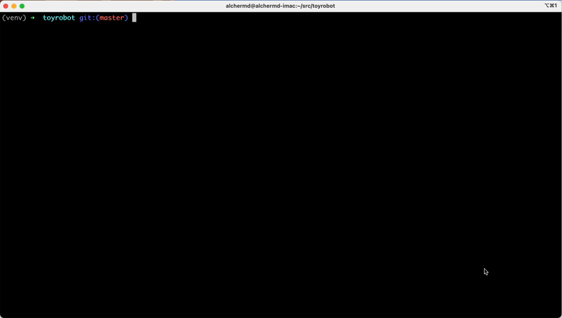

# toyrobot



J.A. Doloiras' submission for the Toy Robot Code Challenge as part of his application for iress.

## Setup (with Docker)

```console
$ docker build -t toyrobot:latest .
$ docker run -it toyrobot
```

The test suite can be run via `docker run toyrobot python runtests.py`

## Setup (without Docker)

```console
$ python3 --version 
Python 3.10.8
$ python3 -m venv venv
$ source ./venv/bin/activate
$ pip install -r requirements.txt
$ python main.py
```

The test suite can be ran via `python runtests.py`

## Usage

Running the `main.py` script will start the app in interactive mode. An example `infile` containing the test commands 
from the instruction PDF is provided. It that can be piped to the main script. For example:

```console
$ cat infile | python main.py > outfile
```

For supported commands, please enter `HELP` on the interactive terminal.