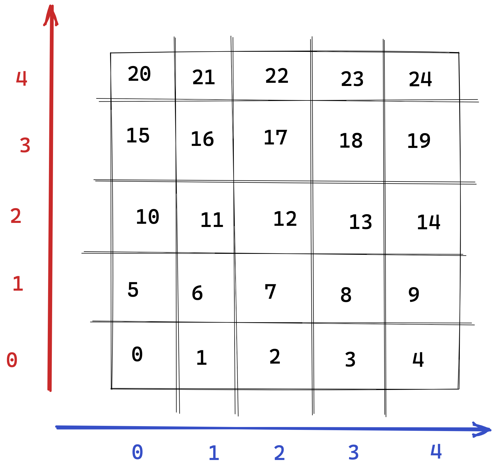

# Error Handling

The current code doesn't handle any moves that would make the robot fall over. And since the in-memory store is a simple
list, it won't even consistently throw an `IndexError` on lower bound errors. This is due to the fact that moving the
robot
downwards is equivalent to subtracting `ncols` to its current index. To visualize, placing the robot at `0,0,S` and
executing a `MOVE` command will move the robot to `store[-5]` -- which is still valid addressing in Python. Let's write
some tests for it:

```python
def test_moving_to_the_south_of_the_first_row_raises_an_exception(self):
    board = Board()
    robot = Robot()
    board.place(robot, x=0, y=0, f=Direction.SOUTH)
    with self.assertRaises(OutOfBoundMovementException):
        board.move(robot)
```

The implementation is simple enough: just check if the target index would be less than zero.

Falling out of bounds northward is similar:

```python
def test_moving_to_the_north_of_the_last_row_raises_an_exception(self):
    board = Board()
    robot = Robot()
    board.place(robot, x=0, y=4, f=Direction.NORTH)
    with self.assertRaises(OutOfBoundMovementException):
        board.move(robot)
```

... in which the implementation is to check if the target index is greater than the store's length.

Falling out of to the west and east is essentially the same:

```python
def test_moving_to_the_west_of_first_column_raises_an_exception(self):
    board = Board()
    robot = Robot()
    board.place(robot, x=0, y=4, f=Direction.WEST)
    with self.assertRaises(OutOfBoundMovementException):
        board.move(robot)


def test_moving_to_the_east_of_the_last_row_raises_an_exception(self):
    board = Board()
    robot = Robot()
    board.place(robot, x=4, y=0, f=Direction.EAST)
    with self.assertRaises(OutOfBoundMovementException):
        board.move(robot)
```

The solution is different though: falling out of bounds horizontally means either incrementing or decrementing the
current index, in which except `0,0` and `4,4` will always yield a valid address. The correct idea then is to determine
if the current index _and_ the direction the robot is facing won't make the robot fall out. Looking at a drawn out
representation of the board, it's easy to spot that the first column contains `n % ncols == 0` and the last column
contains `(n + 1) % ncols == 0`.



To further validate the correctness of the code, and given the fact that there's not a lot of coordinates to test for,
I've decided to refactor the code to a table-based test case. To future-proof the code, I decided to subclass the base
`OutOfBoundMovementException` into separate directional exceptions as well:

```python
class OutOfBoundMovementsTestCase(unittest.TestCase):
    def setUp(self):
        self.moves = [
            # First row
            (Coordinates(0, 0, Direction.SOUTH), SouthOutOfBoundException),
            (Coordinates(0, 0, Direction.WEST), WestOutOfBoundException),
            (Coordinates(1, 0, Direction.SOUTH), SouthOutOfBoundException),
            (Coordinates(2, 0, Direction.SOUTH), SouthOutOfBoundException),
            (Coordinates(3, 0, Direction.SOUTH), SouthOutOfBoundException),
            (Coordinates(4, 0, Direction.SOUTH), SouthOutOfBoundException),
            (Coordinates(4, 0, Direction.EAST), EastOutOfBoundException),
            # Second row
            (Coordinates(0, 1, Direction.WEST), WestOutOfBoundException),
            (Coordinates(4, 1, Direction.EAST), EastOutOfBoundException),
            # Third row
            (Coordinates(0, 2, Direction.WEST), WestOutOfBoundException),
            (Coordinates(4, 2, Direction.EAST), EastOutOfBoundException),
            # Fourth row
            (Coordinates(0, 3, Direction.WEST), WestOutOfBoundException),
            (Coordinates(4, 3, Direction.EAST), EastOutOfBoundException),
            # Fifth row
            (Coordinates(0, 4, Direction.NORTH), NorthOutOfBoundException),
            (Coordinates(0, 4, Direction.WEST), WestOutOfBoundException),
            (Coordinates(1, 4, Direction.NORTH), NorthOutOfBoundException),
            (Coordinates(2, 4, Direction.NORTH), NorthOutOfBoundException),
            (Coordinates(3, 4, Direction.NORTH), NorthOutOfBoundException),
            (Coordinates(4, 4, Direction.NORTH), NorthOutOfBoundException),
            (Coordinates(4, 4, Direction.EAST), EastOutOfBoundException),
        ]

    def test_moving_out_of_bounds_raises_an_exception(self):
        for coordinate, exception in self.moves:
            board = Board()
            robot = Robot()
            board.place(robot, x=coordinate.x, y=coordinate.y, f=coordinate.f)
            with self.assertRaises(exception):
                board.move(robot)
```